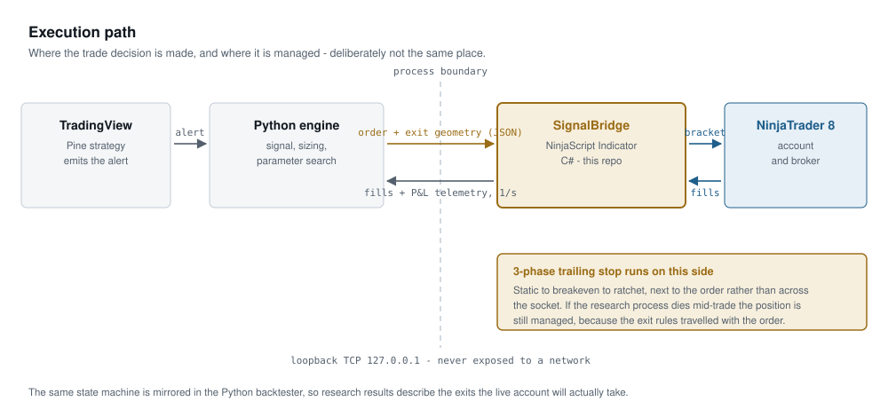
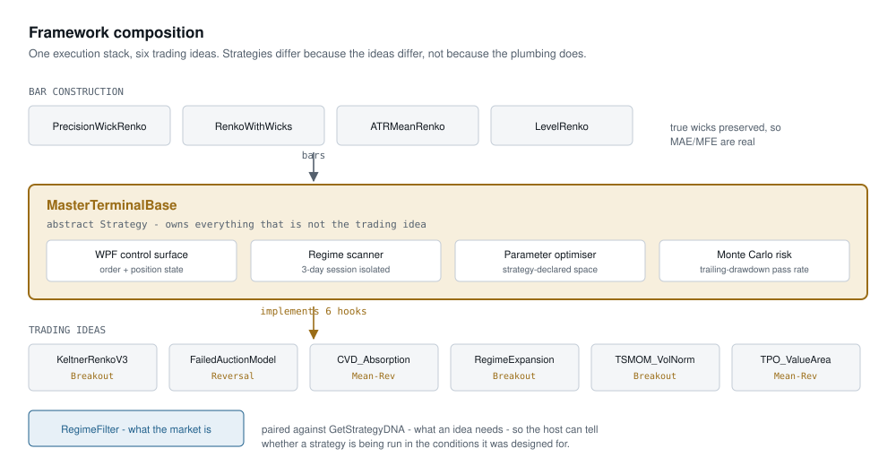

# NinjaTrader Execution Framework

**A strategy host, execution bridge and custom bar-construction suite for NinjaTrader 8 — one execution stack, six trading models, and a loopback API that routes external quantitative signals into NT8 with backtest-to-live parity.**

Roughly 7,600 lines of NinjaScript C# plus the Python counterpart to the bridge. Every file carries a header explaining the engineering decisions behind it, not just what the code does.

---

## Architecture

<picture>
  <source media="(prefers-color-scheme: dark)" srcset="docs/diagrams/execution-path-dark.svg">
  
</picture>

<picture>
  <source media="(prefers-color-scheme: dark)" srcset="docs/diagrams/framework-dark.svg">
  
</picture>

---

## Start here — three files that show the range

| | What it demonstrates |
|---|---|
| **[SignalBridge.cs](api-bridge/SignalBridge.cs)** | API integration. A TCP listener hosted inside NinjaTrader, a typed JSON protocol, threaded socket handling with split locks, and a 3-phase trailing stop state machine deliberately placed on the platform side of the process boundary. |
| **[MasterTerminalBase.cs](framework/MasterTerminalBase.cs)** | Architecture. A 985-line abstract Strategy that owns the WPF control surface, order lifecycle, regime scanner, parameter optimiser and Monte Carlo risk model. Six strategies inherit from it and implement six members each. |
| **[PrecisionWickRenko.cs](bar-types/PrecisionWickRenko.cs)** | Platform mastery. A custom `BarsType` built from raw ticks that preserves true intra-brick excursion, with explicit handling for the NT8 reload lifecycle that otherwise emits thousands of phantom bricks. |

---

## Why this exists

Retail platforms make two things hard: getting an external quantitative signal into the order path without losing time or fidelity, and trusting that a backtest describes the trades the live account will actually take.

This framework addresses both directly.

**Signal routing.** Research runs where research is good — Python, with the scientific stack. Execution runs where execution belongs — inside NinjaTrader, next to the order. The two are joined by a loopback TCP socket carrying orders *and their exit geometry*, so the platform can manage a position to completion even if the research process is restarted or dies mid-trade.

**Backtest fidelity.** Standard Renko reports only the brick box, which hides the price that actually traded inside it. A stop that was genuinely touched during brick formation never appears in the series, so the backtest records a winner on a trade that would have been stopped out. The error is not random — it favours the strategy every single time. The bar types here preserve true wicks, which is what makes excursion-based analysis meaningful at all.

Those two decisions connect: real excursion data is what allows the Monte Carlo model in the host to simulate a **funded-account trailing drawdown**, where a trade that closed at +1R after trading 2R against you can still breach the account rule intramove. A single equity curve cannot show that. Resampling the trade sequence can.

---

## Repository layout

```
framework/      MasterTerminalBase — the host all strategies inherit from
                RegimeFilter — market state classification
strategies/     Six trading models, each implementing only its idea
bar-types/      Four custom BarsType implementations
api-bridge/     SignalBridge.cs (C#) + nt8_bridge.py (Python counterpart)
docs/           Architecture diagrams and component notes
```

### framework/

**MasterTerminalBase** is an abstract `Strategy`. It exists because the usual NinjaScript pattern — one self-contained file per strategy — copy-pastes execution, risk and UI code into every model, where it drifts. A bracket bug then gets fixed in one file and silently survives in the others, and two strategies become non-comparable because they no longer execute identically. Centralising execution means results differ because the *ideas* differ, which is the only way comparing them means anything.

The extension contract is six members:

```csharp
protected abstract void OnStrategyInitialize();
protected abstract void OnStrategyBarUpdate();
protected abstract string GetStrategyDNA();
public virtual void GetStrategySessionWindow(out int startHHMM, out int endHHMM);
public virtual List<OptimizationParam> GetOptimizableParameters();
public virtual List<SimTrade> EvaluateCandidateParameters(List<BrickData>, Dictionary<string,double>);
```

The last two are what let the host optimise a strategy it knows nothing about: the strategy declares its own parameter space *and* its own scoring function, and the host runs the search. Scoring is delegated rather than fixed centrally because a mean-reversion model and a breakout model do not succeed or fail on the same measure.

**RegimeFilter** classifies the market as Range, Trend Up, Trend Down or High Volatility. It pairs with `GetStrategyDNA()` — the filter says what the market *is*, the DNA says what an idea *needs* — so the host can tell whether a strategy is running in conditions it was designed for.

### strategies/

Six models, all inheriting the host. Each header documents the idea and the decisions behind it.

| Strategy | Family | Core idea |
|---|---|---|
| [KeltnerRenkoV3](strategies/KeltnerRenkoV3.cs) | Breakout | Channel breach with pullback structure counted in bricks, and a forward-projected channel to avoid entering against a band that already lags |
| [FailedAuctionModel](strategies/FailedAuctionModel.cs) | Reversal | Auction probes beyond value and fails; hunts the failure inside a bounded window |
| [CVDAbsorptionDivergence](strategies/CVDAbsorptionDivergence.cs) | Mean-reversion | Price slopes down while cumulative delta slopes up — absorption, confirmed before entry |
| [RegimeExpansionBreakout](strategies/RegimeExpansionBreakout.cs) | Breakout | Squeeze duration as a signal, with a separate exhaustion exit from the stop |
| [TimeSeriesMomentum](strategies/TimeSeriesMomentum.cs) | Breakout | Momentum with exposure scaled by Garman-Klass volatility |
| [TPO_ValueAreaRotation](strategies/TPO_ValueAreaRotation.cs) | Mean-reversion | Session volume profile, rotations back toward prior-session value |

### bar-types/

Four `BarsType` implementations, which are successive answers to one question: **how much of the real price path should a synthetic bar preserve?**

- **[PrecisionWickRenko](bar-types/PrecisionWickRenko.cs)** — tick-built, true wicks, hardened against the NT8 reload lifecycle
- **[RenkoWithWicks](bar-types/RenkoWithWicks.cs)** — the original wick-preserving implementation
- **[ATRMeanRenko](bar-types/ATRMeanRenko.cs)** — brick size as a percentage of ATR, so signal density does not drift with volatility
- **[LevelRenko](bar-types/LevelRenko.cs)** — bricks anchored to an absolute price grid rather than to chart load time, which is what makes a brick close reproducible across machines and therefore comparable between research and live

They register overlapping `BarsPeriodType` ids and are intended to be installed **one at a time**, not side by side.

### api-bridge/

`SignalBridge.cs` is implemented as an **Indicator, not a Strategy** — a Strategy is torn down and rebuilt by NinjaTrader on parameter changes, data reloads and connection events, which would drop a live listener socket and orphan working orders. An Indicator has a stable lifetime and reaches the account directly.

It binds to `IPAddress.Loopback` only, so the order-entry endpoint is unreachable from off the machine by construction rather than by firewall rule.

`nt8_bridge.py` is the Python counterpart. The interface between them is an order *plus its exit geometry* — not a stream of instructions — which is what allows the Python process to restart or crash without stranding a live position.

---

## Requirements

- NinjaTrader 8
- `CVDAbsorptionDivergence` additionally requires the NinjaTrader **Order Flow** addon and will not compile without it
- `SignalBridge` requires a reference to `System.Web.Extensions` for `JavaScriptSerializer`
- Python 3.10+ for the bridge counterpart

Install NinjaScript files via **Tools → Edit NinjaScript**, paste, and compile with F5. Bar types require a NinjaTrader restart before appearing in the Data Series dropdown.

---

## Scope and honesty notes

This repository is published to show engineering work on the NinjaTrader platform. A few things it deliberately does not claim:

- **No performance or return figures are presented.** Strategy results depend on instrument, period, costs and fills, and a number without that context is marketing rather than evidence.
- The six strategies are **research models**, not a recommendation to trade them.
- The four bar types are **iterations on one problem**, kept together because the progression is the interesting part, not because all four should be installed.
- `LevelRenko` was renamed from an internal working title when this repository was assembled; its registered display name changed with it.

---

## License

MIT — see [LICENSE](LICENSE).
